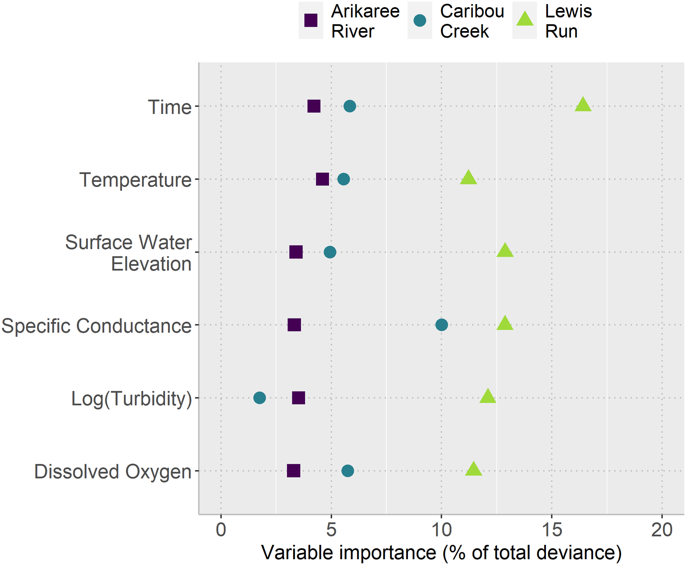

# What Can Sensors Tell Us About Nitrate in Freshwater Streams?

## Why is nitrate difficult to monitor?
Nitrate is an important part of freshwater ecosystems, but too much of it can cause serious problems. Excess nitrate can contribute to eutrophication, where increased plant and algal growth can reduce oxygen levels and harm aquatic life [@camargo2005; @bricker2008]. Keeping track of nitrate is therefore an important part of understanding and managing freshwater quality.

The challenge is that nitrate levels can change over time and respond to many environmental conditions. Traditional water sampling provides valuable information, but collecting samples frequently can be costly and may miss short-term changes. High-frequency sensors offer another approach: they can continuously record nitrate and other water-quality conditions, providing a much more detailed picture of what is happening in a stream [@park2020; @rodriguezperez2020].

But collecting more data does not automatically tell us what matters. **Which sensor measurements are most useful for understanding changes in nitrate, and do they tell the same story in different streams?** A study by @kermorvant2023 explored these questions using sensor data from three very different freshwater streams across the United States.

## Three streams, three very different settings
To explore what sensors can tell us about nitrate, @kermorvant2023 used data from the National Ecological Observatory Network (NEON), which collects high-frequency environmental measurements across the United States. The study focused on three streams in very different environmental settings: Arikaree River in Colorado, Caribou Creek in Alaska and Lewis Run in Virginia.

As @tbl-sites shows, these streams differ substantially in climate, surrounding landscape and flow conditions. This makes them useful for asking whether the same sensor measurements can help us understand nitrate across different freshwater environments.

| Site | Climate | Surrounding landscape | Stream conditions | Urbanised? |
|:---|:---|:---|:---|:---:|
| **Arikaree River, Colorado** | Semi-arid | Grasslands and agriculture | Intermittent; can dry in summer | No |
| **Caribou Creek, Alaska** | Subarctic | Taiga and permafrost | Perennial; ice-covered in winter | No |
| **Lewis Run, Virginia** | Temperate | Fields, pastures, woodlands and small ponds | Perennial | Yes |

: Three contrasting freshwater sites included in the study. Source: @kermorvant2023. {#tbl-sites}

## The same measurements, but a different story
Despite their very different environments, the three streams had something surprising in common. The same six measurements, including specific conductance, dissolved oxygen, water temperature, turbidity, time and surface-water elevation, were useful for understanding nitrate at all three sites. Together with the model's temporal component, they explained about 99% of the variation in nitrate levels at each stream [@kermorvant2023].

However, **the same measurements did not matter equally everywhere**. As @fig-variable-importance shows, the relative importance of each measurement changed from one stream to another.

{#fig-variable-importance}

At **Lewis Run**, specific conductance stood out as the most important measured variable, contributing more than 15% to the model's explanatory power. It was also the most important measured variable at **Caribou Creek**, at around 10%. At **Arikaree River**, however, no single measured water-quality variable clearly dominated. Instead, changes over time played a particularly important role in explaining nitrate patterns [@kermorvant2023].

This comparison answers an important part of our original question: sensors can provide valuable information about nitrate across very different streams, but **which measurements tell us the most depends on where we are monitoring**.

## What does this mean for freshwater monitoring?
So, do sensors tell the same story everywhere? **Not quite**.

The study shows that high-frequency sensors can provide a detailed picture of how nitrate changes alongside other water-quality conditions. Although the same six factors were useful across all three streams, their importance varied from place to place. **This means the same factors may be worth considering across streams, but their monitoring priority should not be assumed to be the same everywhere** [@kermorvant2023].

For freshwater monitoring, this makes **local context important**. A measurement that provides useful information about nitrate in one stream may be less informative in another. Rather than treating one monitoring approach as universal, environmental professionals can use this type of analysis to identify which measurements are most informative for their particular stream and make more targeted decisions about where monitoring resources are spent.

## What should we take from this?
Monitoring nitrate is challenging because stream conditions can change quickly, and occasional water samples may not capture the full picture. High-frequency sensors can help fill this gap by providing a much more detailed view of how nitrate changes alongside other water-quality conditions.

The study by @kermorvant2023 shows both the potential and the limits of this approach. Across three very different streams, the same six measurements were useful for understanding nitrate, and the final models explained about 99% of the variation in nitrate levels. However, the importance of individual measurements differed between sites. **The key message is not that one sensor matters most everywhere, but that the value of each measurement depends on the stream being monitored.**

These findings are promising, but they should not be treated as a universal recipe for freshwater monitoring. The study examined only three streams using roughly two years of data, and further work across more locations and longer periods is needed [@kermorvant2023]. Still, high-frequency sensor data can give environmental professionals a richer understanding of nitrate dynamics and help them make more informed, locally appropriate monitoring decisions.

## References

::: {#refs}
:::
