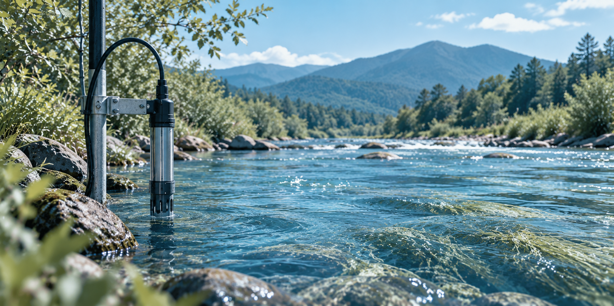

::: {.blog-lede}
Freshwater quality can change in ways we cannot easily see. Can sensors help us understand these changes? A study of three US streams suggests that the answer depends on where we look.
:::

## Why is nitrate difficult to monitor?

Nitrate is a natural part of freshwater ecosystems, but too much of it can cause problems. Excess nitrate can contribute to eutrophication, a process where excessive plant and algal growth can reduce oxygen levels and harm aquatic life [@camargo2005; @bricker2008].

:::: {.columns}

::: {.column width="50%"}
Monitoring nitrate is not always straightforward. Nitrate levels can change over time depending on environmental conditions, while traditional water sampling may miss short-term changes.

High-frequency sensors offer another approach by continuously recording water-quality conditions, such as water temperature and dissolved oxygen, which may help us better understand changes in nitrate [@park2020; @rodriguezperez2020].
:::

::: {.column width="50%"}
{#fig-river-monitoring width="90%"}
:::

::::

However, collecting more data does not necessarily tell us which measurements are most useful for understanding nitrate.

::: {.research-question}

**The key question**

Which sensor measurements are most useful for understanding nitrate patterns and do they tell the same story across different streams?

:::

A study by @kermorvant2023 explored these questions using high-frequency sensor data from three freshwater streams in the United States.


## Three streams, three different environments
To explore what sensors can tell us about nitrate, @kermorvant2023 used data from the National Ecological Observatory Network (NEON), which collects high-frequency environmental measurements across the United States. The study focused on three streams in very different environmental settings: Arikaree River in Colorado, Caribou Creek in Alaska and Lewis Run in Virginia.

As @tbl-sites shows, these streams differ substantially in climate, surrounding landscape and flow conditions. This makes them useful for asking whether the same sensor measurements can help us understand nitrate across different freshwater environments.

```{r}
#| label: setup
#| include: false
library(tidyverse)
library(knitr)
library(plotly)
```

```{r}
#| label: tbl-sites
#| tbl-cap: "Three contrasting freshwater sites included in the study. Source: @kermorvant2023."
#| echo: false

sites <- tribble(
  ~Site, ~Climate, ~`Surrounding landscape`, ~`Stream conditions`, ~`Urbanised?`,
  "Arikaree River, Colorado", "Semi-arid",
  "Grasslands and agriculture", "Intermittent; can dry in summer", "No",
  "Caribou Creek, Alaska", "Subarctic",
  "Taiga and permafrost", "Perennial; ice-covered in winter", "No",
  "Lewis Run, Virginia", "Temperate",
  "Fields, pastures, woodlands and small ponds", "Perennial", "Yes"
)

knitr::kable(
  sites,
  format = "html",
  table.attr = 'class="themed-table"'
)
```

These differences matter because local environmental conditions may influence nitrate patterns. For example, Arikaree River can dry out during summer, while Caribou Creek remains flowing throughout the year, even though it may be covered by ice in winter. Such differences help explain why it is important to compare streams rather than assume they all behave in the same way.

## Same factors, different stories
Despite their very different environments, the three streams had something interesting in common. The study identified the same six factors as useful for understanding nitrate patterns across all three sites: specific conductance (how well water conducts electricity), dissolved oxygen, water temperature, turbidity (water cloudiness), time and water level. The statistical models provided a very close fit to the observed nitrate patterns, explaining approximately 99% of the deviance at each stream [@kermorvant2023].

However, the **same factors did not matter equally everywhere**. As @fig-variable-importance shows, their relative importance differed between the three streams.

```{r}
#| label: fig-variable-importance
#| fig-cap: "Relative importance of six factors in explaining nitrate patterns across three freshwater streams. Approximate values visually estimated from Kermorvant et al. (2023), Figure 4. Dark blue indicates the highest contribution at each site."
#| echo: false
#| warning: false
#| message: false
#| column: page

# Approximate values from Kermorvant et al. (2023), Figure 4
importance_data <- tribble(
  ~site, ~variable, ~importance,
  "Arikaree River", "Time", 4.2,
  "Arikaree River", "Water temperature", 4.6,
  "Arikaree River", "Water level", 3.4,
  "Arikaree River", "Specific conductance", 3.3,
  "Arikaree River", "Water cloudiness", 3.5,
  "Arikaree River", "Dissolved oxygen", 3.3,

  "Caribou Creek", "Time", 5.8,
  "Caribou Creek", "Water temperature", 5.6,
  "Caribou Creek", "Water level", 4.9,
  "Caribou Creek", "Specific conductance", 10.0,
  "Caribou Creek", "Water cloudiness", 1.8,
  "Caribou Creek", "Dissolved oxygen", 5.7,

  "Lewis Run", "Time", 16.4,
  "Lewis Run", "Water temperature", 11.2,
  "Lewis Run", "Water level", 12.9,
  "Lewis Run", "Specific conductance", 12.9,
  "Lewis Run", "Water cloudiness", 12.1,
  "Lewis Run", "Dissolved oxygen", 11.5
)

# Prepare data and identify the highest contribution
plot_data <- importance_data |>
  group_by(site) |>
  mutate(
    highest = importance == max(importance)
  ) |>
  ungroup() |>
  mutate(
    variable = factor(
      variable,
      levels = rev(c(
        "Time",
        "Water temperature",
        "Water level",
        "Specific conductance",
        "Water cloudiness",
        "Dissolved oxygen"
      ))
    ),
    site = factor(
      site,
      levels = c(
        "Arikaree River",
        "Caribou Creek",
        "Lewis Run"
      )
    ),
    hover_text = paste0(
      "<b>", site, "</b>",
      "<br>Factor: ", variable,
      "<br>Contribution: ", importance, "%",
      if_else(
        highest,
        "<br><b>Highest at this site</b>",
        ""
      )
    )
  )

# Create the plot
p <- ggplot(
  plot_data,
  aes(x = importance, y = variable)
) +

  # Vertical reference line at zero
  geom_vline(
    xintercept = 0,
    colour = "#8299A3",
    linewidth = 0.7
  ) +

  # Horizontal lines from zero to each point
  geom_segment(
    aes(
      x = 0,
      xend = importance,
      yend = variable
    ),
    colour = "#B8D4DF",
    linewidth = 0.5
  ) +

  # Points with interactive hover information
  geom_point(
    aes(
      colour = highest,
      text = hover_text
    ),
    size = 2.5
  ) +

  # Three panels
  facet_wrap(~site, ncol = 3) +

  # Colours matching the website theme
  scale_colour_manual(
    values = c(
      "FALSE" = "#428BA8",
      "TRUE" = "#24566B"
    ),
    guide = "none"
  ) +

  # X-axis
  scale_x_continuous(
    limits = c(-0.5, 20),
    breaks = seq(0, 20, 5),
    expand = expansion(mult = c(0, 0.02))
  ) +

  # Axis labels
  labs(
    x = "Contribution to explaining nitrate patterns (%)",
    y = NULL
  ) +

  # Theme
  theme_minimal(base_size = 11) +
  theme(
    # Subtle border around the plot
    plot.background = element_rect(
      fill = "#FAFAF8",
      colour = "#D5E3E8",
      linewidth = 0.5
    ),

    # Light blue panel backgrounds
    panel.background = element_rect(
      fill = "#F0F6F8",
      colour = NA
    ),

    # Panel titles
    strip.text = element_text(
      face = "bold",
      colour = "#24566B",
      size = 11
    ),

    # Axis text
    axis.text = element_text(
      colour = "#2B2B2B",
      size = 10
    ),

    # Axis title
    axis.title = element_text(
      colour = "#2B2B2B",
      size = 11
    ),

    # Grid lines
    panel.grid.major.y = element_blank(),
    panel.grid.minor = element_blank(),

    # Remove legend
    legend.position = "none",

    # Spacing between panels
    panel.spacing = grid::unit(1, "lines"),

    # Space inside plot border
    plot.margin = margin(12, 12, 12, 12)
  )

# Convert to interactive Plotly graph
interactive_plot <- ggplotly(
  p,
  tooltip = "text",
  height = 350
) |>
  layout(
    autosize = TRUE
  ) |>
  config(
    responsive = TRUE,
    displaylogo = FALSE
  )

# Display interactive plot
interactive_plot
```


At **Arikaree River**, the factors had relatively similar contributions, with water temperature slightly higher at around 5%. At **Caribou Creek**, specific conductance stood out at around 10%, suggesting that this measure of water chemistry was particularly informative for understanding nitrate patterns.

At **Lewis Run**, time had the highest contribution at around 16%. Unlike the other factors, time is not a water-quality measurement. Its importance suggests that changes across the monitoring period played a particularly important role, although the analysis cannot tell us exactly what caused those changes [@kermorvant2023].

These findings help answer our original question: **the same factors can be useful across different streams, but their importance depends on where we are monitoring**.


## What does this mean for freshwater monitoring?
So, do sensors tell the same story everywhere? **Not quite.**

The study shows that high-frequency sensor data can help us understand nitrate patterns across different freshwater streams. Although the same six factors were useful at all three sites, their importance varied from place to place [@kermorvant2023].

For freshwater monitoring, this makes **local conditions important**. A measurement that provides useful information in one stream may be less informative in another. Rather than using the same monitoring priorities everywhere, environmental professionals can consider which measurements are most useful for their particular stream.

However, the study examined only three streams over roughly two years. More research across different environments and longer periods is needed before applying these findings more broadly.

::: {.key-takeaway}

**The key takeaway**

There is no single monitoring priority that works best everywhere. Understanding local conditions can help make freshwater monitoring more targeted and informative.

:::

## References

::: {#refs}
:::
